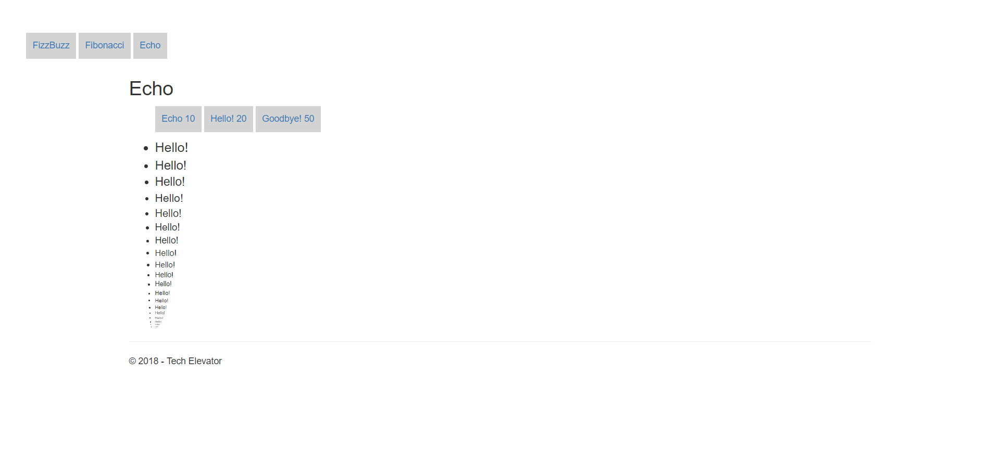

# MVC Views Part 1 Exercises

## 1. FizzBuzz

Modify the `fizzBuzz.jsp` page. The format for the URL will be `http://localhost:8080/mvc-views-part1-exercises/fizzBuzz.jsp?number=20`. The number to go up to is available via the `${ param.number }` variable.

Create an unordered list with the id `fizzbuzz` that contains a list of numbers from 1 up to and including the number. However, the number should be replaced given the following rules:

- If the number is divisible by 3, show "Fizz!" and apply the `fizz` class to the element.

- If the number is divisible by 5, show "Buzz!" and apply the `buzz` class to the element.

- If the number is divisible by both 3 and 5, show "FizzBuzz!" and apply the class `fizzbuzz` to the element.

For instance, given the number 20, the expected output should be:

```html
<ul id="fizzbuzz">
  <li>1</li>
  <li>2</li>
  <li class="fizz">Fizz!</li>
  <li>4</li>
  <li class="buzz">Buzz!</li>
  <li class="fizz">Fizz!</li>
  <li>7</li>
  <li>8</li>
  <li class="fizz">Fizz!</li>
  <li class="buzz">Buzz!</li>
  <li>11</li>
  <li class="fizz">Fizz!</li>
  <li>13</li>
  <li>14</li>
  <li class="fizzbuzz">FizzBuzz!</li>
  <li>16</li>
  <li>17</li>
  <li class="fizz">Fizz!</li>
  <li>19</li>
  <li class="buzz">Buzz!</li>
</ul>
```


## 2. Fibonacci

Modify the `fibonacci.jsp` page that displays the numbers of the Fibonacci sequence up to N, where N is the value of `max`. The format for the URL will be: `http://localhost:8080/mvc-views-part1-exercises/fibonacci.jsp?max=20`. The number to go up to is available via the `${ param.max }` variable.

Create an unordered list with the id `fibonacci` that contains list item elements for each of the numbers in the sequence up to the max number specified in the URL.

For instance, if the value for `max` is 50, the expected output should be:

```html
<ul id="fibonacci">
  <li>1</li>
  <li>2</li>
  <li>3</li>
  <li>5</li>
  <li>8</li>
  <li>13</li>
  <li>21</li>
  <li>34</li>
</ul>
```


## 3. Echo

Modify the `echo.jsp` page that displays a repeated word N number of times with decreasing font until it is no longer visible. The format for the url will be: `http://localhost:8080/mvc-views-part1-exercises/echo.jsp?word=Hello!&count=20`. The word and number of times to display are available via the `${ param.word }` and `${ param.count }` variables.

Create an unordered list that contains a list of items with value of the `word` parameter repeated the number of times specified by the `count` parameter. Also, the font size of the first list item should be equal to `count`, and the font size of each subsequent list item should be decreased by 1.

For instance, given the parameter `word` with a value of "Hello!" and the parameter `count` with a value of 20, the expected output would be:

```html
<ul>
  <li style="font-size: 20px;">Hello!</li>
  <li style="font-size: 19px;">Hello!</li>
  <li style="font-size: 18px;">Hello!</li>
  <li style="font-size: 17px;">Hello!</li>
  <li style="font-size: 16px;">Hello!</li>
  <li style="font-size: 15px;">Hello!</li>
  <li style="font-size: 14px;">Hello!</li>
  <li style="font-size: 13px;">Hello!</li>
  <li style="font-size: 12px;">Hello!</li>
  <li style="font-size: 11px;">Hello!</li>
  <li style="font-size: 10px;">Hello!</li>
  <li style="font-size: 9px;">Hello!</li>
  <li style="font-size: 8px;">Hello!</li>
  <li style="font-size: 7px;">Hello!</li>
  <li style="font-size: 6px;">Hello!</li>
  <li style="font-size: 5px;">Hello!</li>
  <li style="font-size: 4px;">Hello!</li>
  <li style="font-size: 3px;">Hello!</li>
  <li style="font-size: 2px;">Hello!</li>
  <li style="font-size: 1px;">Hello!</li>
</ul>
```


