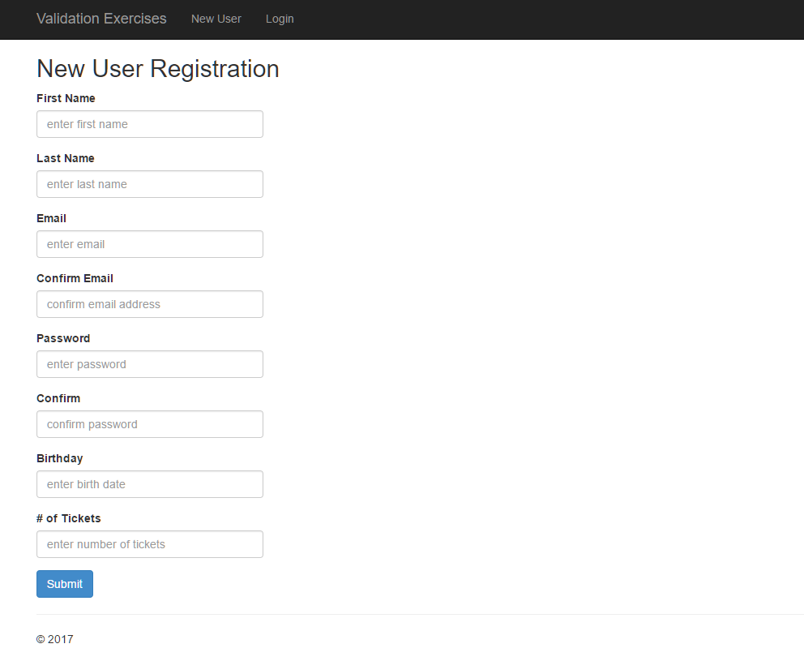
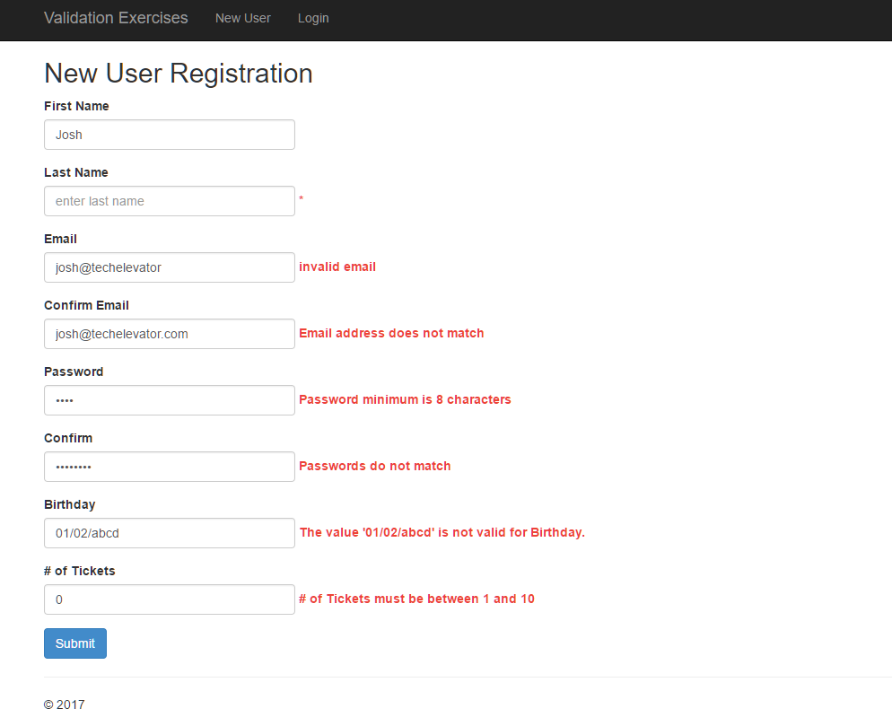
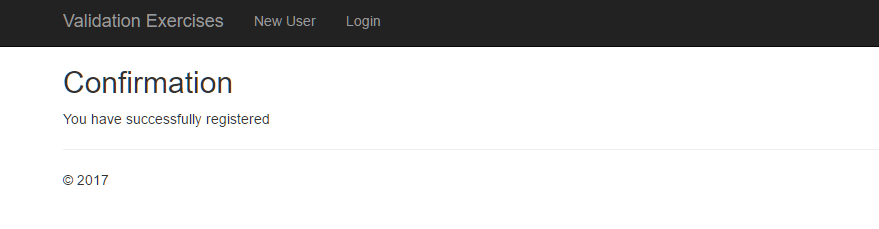

# Form Validation

## Login Form

Create a page that allows the user to _log in_ to the site. This page asks the user for and validates the following information:

| Field      | Rules                         |
| ---------- | ----------------------------- |
| `Email`    | Required, Valid Email Address |
| `Password` | Required                      |

If validation is successful, redirect the user to a confirmation page. You don't need to really log the user in.

If validation is unsuccessful, the user is returned to the page and is provided with hints so they know why validation failed.

### Login Validation Screen

### Login Success Screen

## Registration Form

Create a page that allows the user to _register_ on the site. This page asks the user for and validates the following information:

| Field               | Rules                           |
| ------------------- | ------------------------------- |
| `First Name`        | Required, Max Length (20)       |
| `Last Name`         | Required, Max Length (20)       |
| `Email`             | Required, Valid Email Address   |
| `Confirm Email`     | Must Match `Email`              |
| `Password`          | Required, Minimum Length (8)    |
| `Confirm Password`  | Must Match `Password`           |
| `Birth Date`        | Required, Valid Date            |
| `Number of Tickets` | Required, Valid Range (1 to 10) |

If validation is successful, redirect the user to a confirmation page. You don't need to really register the user.

If validation is unsuccessful, the user is returned to the page and is provided with hints so they know why validation failed. Also, the user shouldn't need to enter all of the information again. The form should "remember" what the user added before sending the request to the server.

### New Registration Page

### Registration Validation Screen

### Registration Success Screen

