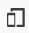
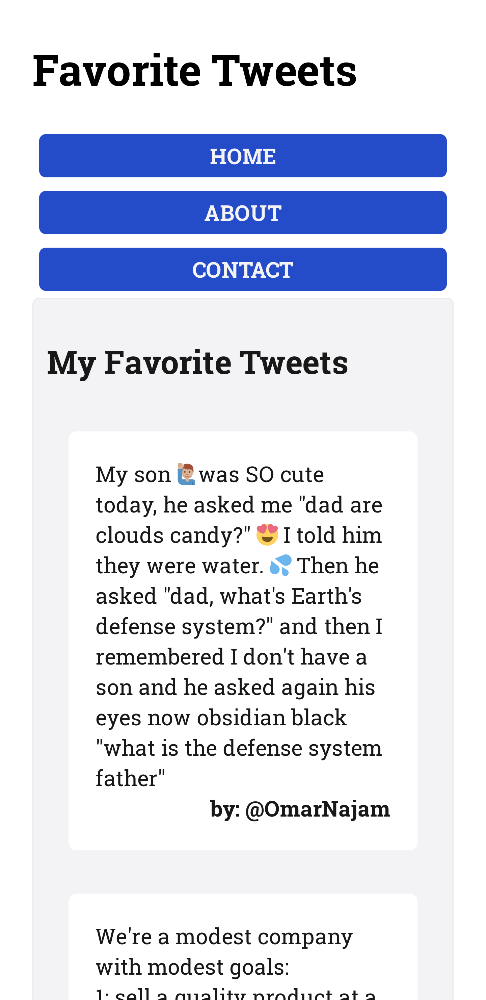

# Responsive Design Tutorial Exercise

In this tutorial, you'll build a "favorite tweets" screen that is responsive at many different screen sizes. You'll want to lay these items out in a grid-like fashion but also allow as many items on the screen as the creator of the webpage wishes to add.

You'll see in the `index.html` file that the basics of the screen are already laid out for you. There's a `header` at the top with a logo and some navigation, a title underneath, the twitter cards, and finally a footer at the bottom. All of these elements are currently set up for mobile viewing, each in its own row, stacked vertically.

But as you make the screen bigger, the site doesn't use the bigger size very well at all. You'll fix this in this exercise.

First, open the `index.html` file in VS Code and click the `Go Live` button. This opens a browser and shows the page:


You can look at this page using different screen sizes within your browser. If you open the Developer Tools in your browser, there's a button to put the browser in "Responsive Design Mode." You can also press Ctrl+Shift+M or Command+Shift+M to go into Responsive Design Mode.



This mode has several new features. You can change the screen size of the browser window, and you can choose different device sizes from the dropdown menu at the top.

Change the width of the screen to be 400px wide. This is roughly the size of a standard mobile phone, and you can see that the site looks halfway decent there.



As you expand this view to 725px or the iPad's 768px, the elements start looking rather stretched on the screen. You can relayout these elements to make better use of the space at this width.

If you open the `style.css` file, you'll see the CSS defined for this page. Many of these styles are just "look and feel" rules, but one to take a look at is the rule for the grid layout of the site:

``` css
/* define the full page grid */
body {
  display: grid;
  grid-template-columns: 1em auto 1em;
  grid-template-areas: 
      '. header .'
      '. nav .'
      '. content .'
      '. footer .';
}

header {
  grid-area: header;
}

nav {
  grid-area: nav;
}

main {
  grid-area: content;
}

footer {
  grid-area: footer;
}
```

Currently, the grid is defined for a small screen. There is one main column with a `1em` gutter down the right and left sides.

The navigation is set up like this:

``` css
/* Organize Nav Items */
nav ul {
  display: flex;
  flex-direction: column;
  justify-content: space-between;
  width: 100%;
}
```

This flows the navigation in a column with each button taking the full width of the screen.

The tweets are also set up in a flex container with their `flex-basis`, or their set width in the container, set to `100%`.

``` css
main .container {
  display: flex;
  flex-flow: row wrap;
  justify-content: flex-start;
}

main .tweet {
  background-color: #fff;
  padding: 20px;
  border-radius: 6px;
  margin: 1rem;
  flex-basis: 100%
}
```

## Setting a 725px breakpoint

Now you'll lay out these elements for a larger screen. The first thing to know is that setting a breakpoint at 725px is completely arbitrary. You want to set the breakpoint where you feel a relaying out of the page makes sense, design-wise.

First, create a Media Query in the CSS document that only activates if the screen is bigger than 725px:

``` css
/* New breakpoint around 725px */
@media only screen and (min-width: 725px) {
  
}
```

**Remember:** Put this rule at the bottom of your CSS. Since rules are applied from top to bottom, putting rules like this at the top of the `.css` file means that the rules inside the Media Query are overwritten. *Media Queries always go at the bottom of the `.css` file.*

Now, you want to think about how the elements should be changed for the bigger screen. One idea is to make the navigation elements in a row rather than in a column. Since you have more horizontal space now, they don't need to be stacked on top of each other. You can do that by redefining the flex container definition:

``` css
/* make the nav links go to one line */
nav ul {
  flex-direction: row;
  justify-content: space-around;
}
```

Now that they are side by side and `space-around` has been defined, they look very squashed. You can tell the flex container to have each link take up a third of the width:

``` css
/* Each nav link should take up just a third of the width (with some padding) */
nav ul li {
  flex-basis: 30%;
}
```

You could also make the tweets not take up the whole width so that they can be seen two at a time. You can do that by making them take up less than half the screen:

``` css
/* Make it so that you have two columns of tweets */
main .tweet {
  flex-basis: 45%;
}
```

That leaves you with this:

``` css
/* New breakpoint around 725px */
@media only screen and (min-width: 725px) {
  /* make the nav links go to one line */
  nav ul {
    flex-direction: row;
    justify-content: space-around;
  }

  /* Each nav link should take up just a third of the width (with some padding) */
  nav ul li {
    flex-basis: 30%;
  }

  /* Make it so that you have two columns of tweets */
  main .tweet {
    flex-basis: 45%;
  }
}
```

## Setting a 900px breakpoint

Once the screen gets even bigger, you have even more real estate to work with. At 900px, the screen feels a little too roomy.

First, add your Media Query to your CSS for screens over 900px:

``` css
/* New breakpoint at 900px */
@media only screen and (min-width: 900px) {
  
}
```

**Remember:** Put this rule below the previous Media Query. Again, because the CSS rules are read from top to bottom, you want these rules to overwrite the ones from the 725px.

Within here, you can add rules for this even larger screen. All the rules from the 725px screen still apply, but rules from this Media Query override them.

First, you can start putting elements next to each other with this much extra width. Put the header and the navigation on the same horizontal line. You'll do this by redefining the grid:

```css
/* Redefine the grid so that you have the nav next to the header */
body {
  grid-template-columns: 2em 1fr 1fr 2em;
  grid-template-areas:
    '. header nav .'
    '. content content .'
    '. footer footer .';
}
```

Now you have a little more gutter around the sides and two equal columns in the middle. You now have the header and the navigation side by side.

The navigation is currently stuck at the top of the header bar now. You can center it using Flexbox:

``` css
/* Center the elements in the nav to the center */
nav {
  display: flex;
  align-items: center;
  justify-content: center;
}
```

You can also make it so there are three columns of tweets:

``` css
/* show three tweets side by side */
main .tweet {
  flex-basis: 29%;
}
```

Now, all of the rules in your CSS file look like this:

``` css
/* New breakpoint at 900px */
@media only screen and (min-width: 900px) {
  /* Redefine the grid so that you have the nav next to the header */
  body {
    grid-template-columns: 2em 1fr 1fr 2em;
    grid-template-areas:
        '. header nav .'
        '. content content .'
        '. footer footer .';
  }

  /* Center the elements in the nav to the center */
  nav {
    display: flex;
    align-items: center;
    justify-content: center;
  }

  /* show three tweets side by side */
  main .tweet {
    flex-basis: 29%;
  }
}
```

You can play and change these as you want to make your page look good at different sizes.